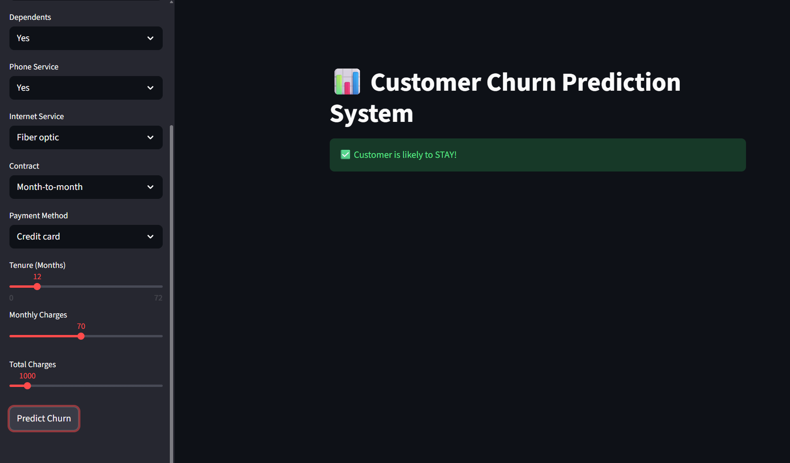
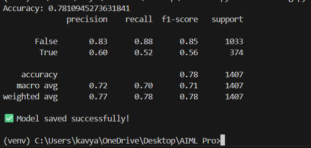

# 📊 Customer Churn Prediction System (XGBoost + Streamlit)

## 🚀 Project Overview
This project predicts whether a telecom customer is likely to **churn (leave the service)** or stay.

Customer churn is a major business problem in subscription-based industries, and predicting it early helps companies improve customer retention strategies.

This is an **end-to-end Machine Learning project** including preprocessing, model training, evaluation, and deployment using Streamlit.

---

## 🎯 Key Features
✅ Data Cleaning & Preprocessing  
✅ One-Hot Encoding for categorical variables  
✅ XGBoost Classification Model  
✅ Achieved ~78% Accuracy  
✅ Evaluation using Precision, Recall, F1-score  
✅ Interactive Streamlit Web Application  

---

## 🛠 Tech Stack
- Python  
- Pandas, NumPy  
- Scikit-learn  
- XGBoost  
- Streamlit  

---

## 📂 Project Structure

customer-churn-prediction/
│
├── app.py # Streamlit Web App
├── churn_training.py # Model Training Script
├── requirements.txt # Dependencies
├── README.md # Project Documentation
│
├── model/
│ ├── churn_model.pkl # Saved Trained Model
│ └── columns.pkl # Feature Columns for Prediction


## 📊 Dataset Used
**Telco Customer Churn Dataset (Kaggle)**

Dataset contains customer information such as:

- Customer tenure  
- Monthly charges  
- Total charges  
- Contract type  
- Payment method  
- Internet service details  

Target Variable:

- **Churn (Yes/No)**

---

## ⚙️ How to Run This Project

### 1️⃣ Clone the Repository
```bash
git clone https://github.com/your-username/customer-churn-prediction.git
cd customer-churn-prediction

2️⃣ Install Required Packages
pip install -r requirements.txt

3️⃣ Train the Machine Learning Model
python churn_training.py


This will generate:

churn_model.pkl

columns.pkl

inside the model/ folder.

4️⃣ Run the Streamlit Web App
streamlit run app.py


The application will open in your browser at:

http://localhost:8501

📌 Results

Model Used: XGBoost Classifier

Accuracy Achieved: ~78%

Evaluation Metrics:

Precision

Recall

F1-score

Confusion Matrix

## 📸 Demo Screenshot





